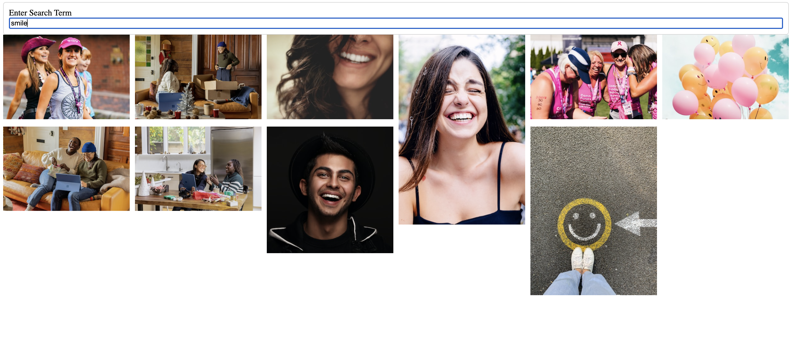

# weather_dashboard
This is an application that shows images based on an user entered term. 

## URL:


## Description
An application that when a term is entered in the search bar, a list of ten images related to term appear. This was made using React.js and the Unsplash api. This is a purely function based app with little design and styling. The creator learned a great deal while making this application to further their knowledge with the REact framework. 

## User Story
```
AS A curious internet user
I WANT to have access to specific images
SO THAT I can use them and show my friends
```

## Acceptance Criteria
```
GIVEN a search bar
WHEN I enter a term
THEN I am presented with ten pictures of what is requested
```

## Screenshot


## API's Used
<p><a href="https://unsplash.com/">Unsplash: An image source API</a></p>


